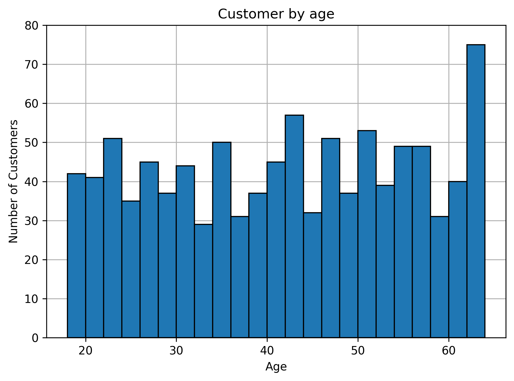
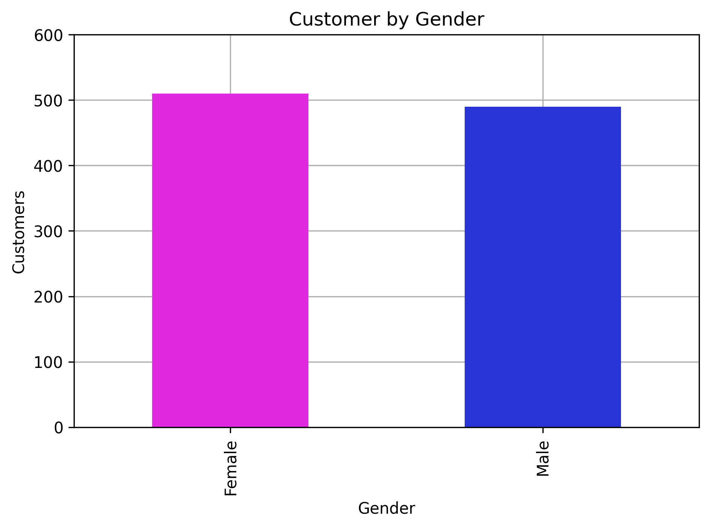
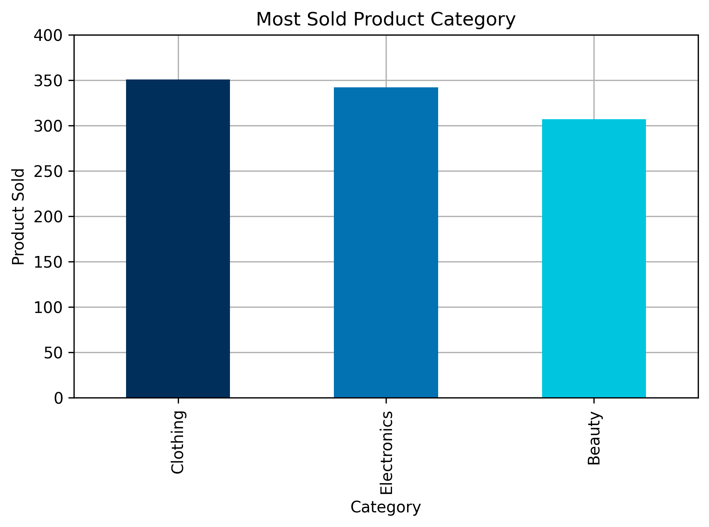
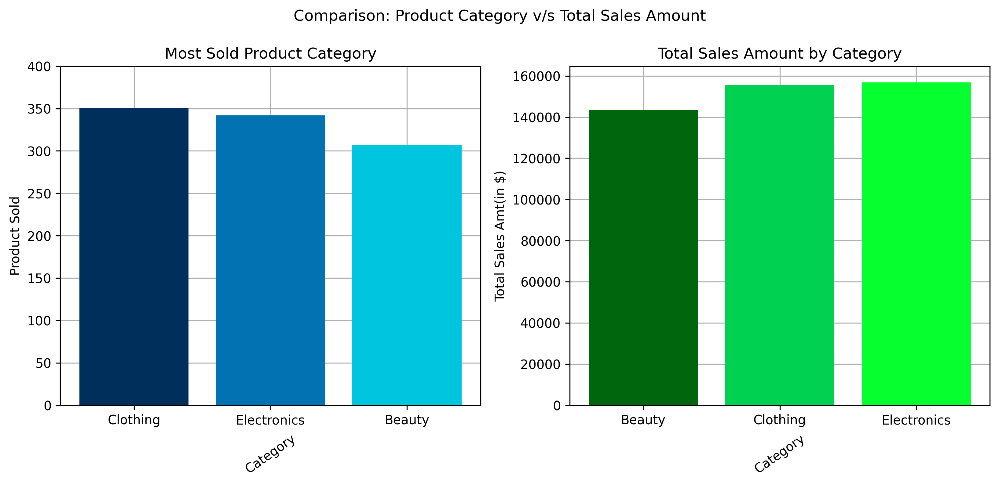
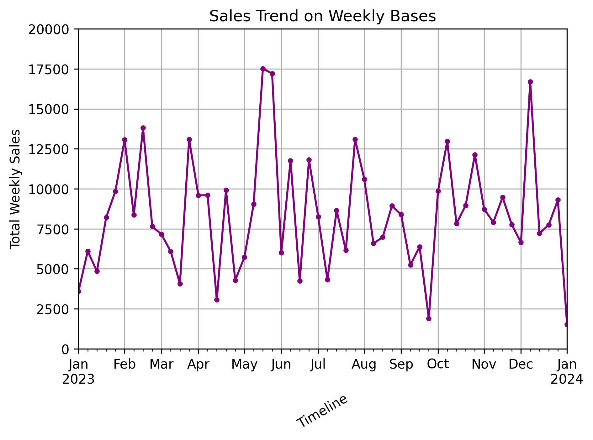
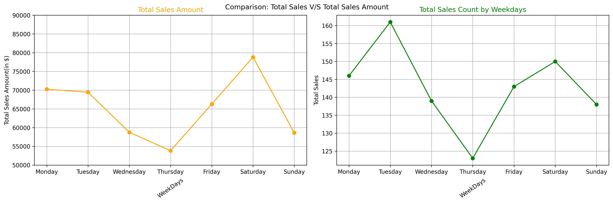

# 🛍️ Retail Sales Analysis (2023)

This project is a full exploratory data analysis (EDA) of Retail sales during the year 2023. It aims to uncover business insights using customer demographics, product categories, and time-based sales behavior.

## Tools used ⚙️
- Python
- Pandas
- Matplotlib
- Jupyter Notebook

---

## 📊 Objectives

- Understand customer distribution by age and gender.
- Identify top-performing product categories.
- Compare sales volume and revenue across categories.
- Analyze yearly sales trends.
- Analysing busiest shopping days.

---

## 📈 Key Visualizations & Insights

### 1. 👥 Customers by Age and Gender

- Majority of customers are aged between **60+ years**.
- **Female shoppers** form a larger portion of Zara's customer base.

---

### 2. 🏷️ Most Sold Product Categories

- **Clothing** dominates in number of items sold.
- **Electronics** shows consistent performance.
- **Beauty** sold least product among all.

---

### 3. 💰 Category vs Total Sales Amount

- Despite **Clothing** being the hhighest sold category but **Electronics** Able to genrate highest Sales Amount.

---

### 4. 📆 Sales Trend Throughout 2023

- Peak sales is in late **may** and early **June**.
- Due to Summer Demand of **AC's, Fan's and cooler's increased**.
- Noticeable dip in **October**, suggesting seasonality effects.

---

### 5. 📅 Most Crowded Weekdays

- **Saturday and Tuesday** are the most crowded days in stores.
- Mid-week traffic is relatively low, with Thursday being the least active.

---

## 🧠 Learnings

- Retail sales follow clear seasonal patterns.
- Customer demographics significantly influence sales outcomes.
- Data visualization reveals valuable business trends not obvious in raw data.

